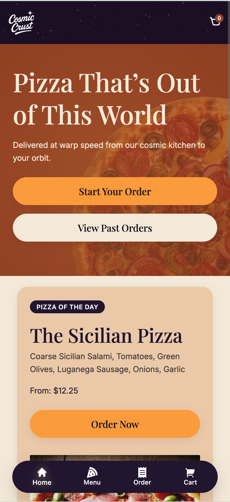

# 🌌 **Cosmic Crust** – A Space-Age Pizza Experience  
*A premium UI/UX + full-stack portfolio project built for warp-speed cravings.* 🍕✨

**Cosmic Crust** is a fictional intergalactic pizza brand brought to life through a modern, fully custom React application. The project blends **high-end product design**, **cinematic visuals**, and a **modular, scalable frontend architecture** to create a restaurant-ordering experience that feels truly *out of this world*.

This repo includes a fully defined **brand design system**, a **cosmic visual language**, custom **animated UI elements**, and a strong emphasis on **modern frontend engineering workflows**.

The project is actively evolving as new features, galaxies, and toppings are discovered. 🪐

---

# 🚀 Tech Stack

## **Frontend**
Designed for speed, composability, and delightful user experience:

- **React + TypeScript** – Component-driven UI built for scalability  
- **Vite** – Ultra-fast bundling and dev server ⚡  
- **Tailwind CSS (v4)** – Utility-first styling powered by a custom cosmic design system  
- **TanStack Router** – Type-safe routing with zero runtime surprises  
- **TanStack Query** – Server state, caching, mutations, and async data management  
- **Custom Design System**  
  - Cosmic brand palette (plum, orange, gold, sand, beige neutrals)  
  - Cinematic cosmic backgrounds (1024×1024 WEBP textures)  
  - Animated stardust layers + parallax hero elements  
  - Responsive layout primitives & reusable UI components  

## **Backend**
Powering the Cosmic Crust Command Center:

- **Fastify** – Lightweight, fast Node.js backend for API routes  
- **SQLite** – File-based persistence for pizzas, toppings, and orders  
- **REST API Architecture** – Simple, modular, and easy to extend  

---

# 🌠 Current Features

This project is in active development. Recent enhancements include:

### ⭐ **Branding & UI/UX**
- Fully developed cosmic brand identity (typography, color tokens, radii, shadows)  
- Cinematic Hero section with parallax pizza, cosmic glow, and drifting stardust  
- Tailwind-native theme tokens for colors, fonts, radii, shadows, and animations  
- Mobile-first layout improvements across all pages  
- Card redesigns, component refinements, and increased visual hierarchy  

### ⭐ **Core Product Features**
- Fully functional ordering workflow  
- Dynamic pizza configuration system  
- Interactive shopping cart with item removal animations  
- Persistent cart context  
- Menu components using real food photography assets  
- Responsive, accessible UI patterns  

### ⭐ **Upcoming Enhancements**
- Admin dashboard for managing pizzas & orders  
- Planet-themed topping variants  
- More parallax, micro-interactions, and scroll-based motion  
- Desktop UI polishing and refined component hierarchy  
- Additional cosmic illustrations, overlays, and textures  

---

## 🛸 Getting Started

Clone the repository and fire up both the client and server (in separate terminal tabs) to explore the early cosmos:

```bash
git clone https://github.com/your-username/cosmic-crust.git
cd cosmic-crust
```

## Client (Frontend React app)
```bash
cd client
npm install
npm run dev
```

## Server (Backend Fastify server (including API routes))
```bash
cd server
npm install
npm run dev
```

---

## 📸 App Screenshots

### **Desktop Experience**
<p align="center">
  
</p>

---

### **Mobile Experience**
<p align="center">
  
</p>

> The Cosmic Crust UI adapts seamlessly across devices, maintaining consistent branding, layout integrity, and a polished, app-like user experience.

---
